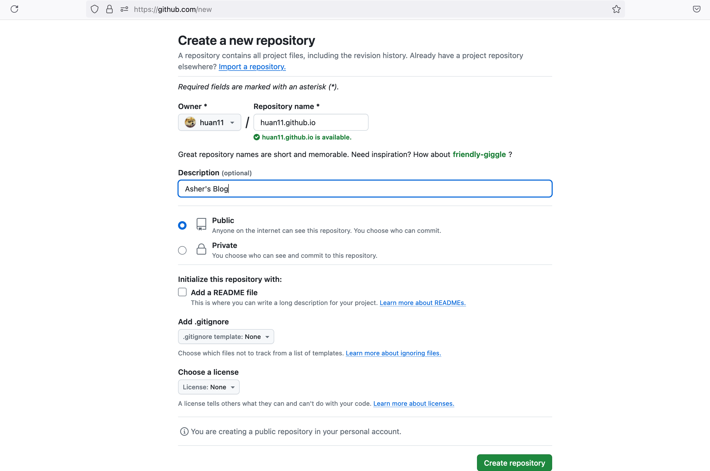
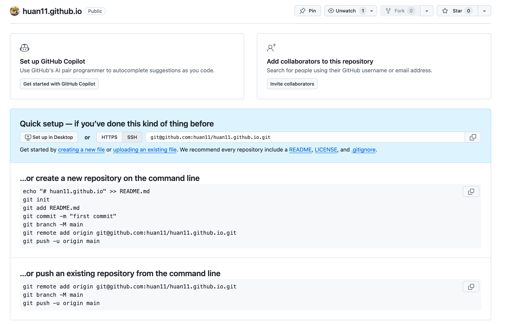

# Dependencies

Setup static blog

1. Git https://git-scm.com/downloads
2. Hugo https://github.com/gohugoio/hugo
3. [optional] markdown editor: Typora


Automatic Deploy

1. GitHub Action https://docs.github.com/en/actions/quickstart

# How to set up Static Blog?

## Setup static blog(3 steps)

Reuse the others framework

> https://github.com/xyming108/sulv-hugo-papermod
>
> preview : https://www.sulvblog.cn/


step 1 clone

```
git clone https://github.com/xyming108/sulv-hugo-papermod.git
```


step2 download theme

```
git submodule update --init
```


Step3  start the 

```
hugo server -D
```


## Deploy automatically( steps)

Step create github repo(must public)





Step use github repo to store the blog(not public folder under the hugo blog)

```
git remote add origin git@github.com:huan11/huan11.github.io.git
```


Step config github action


