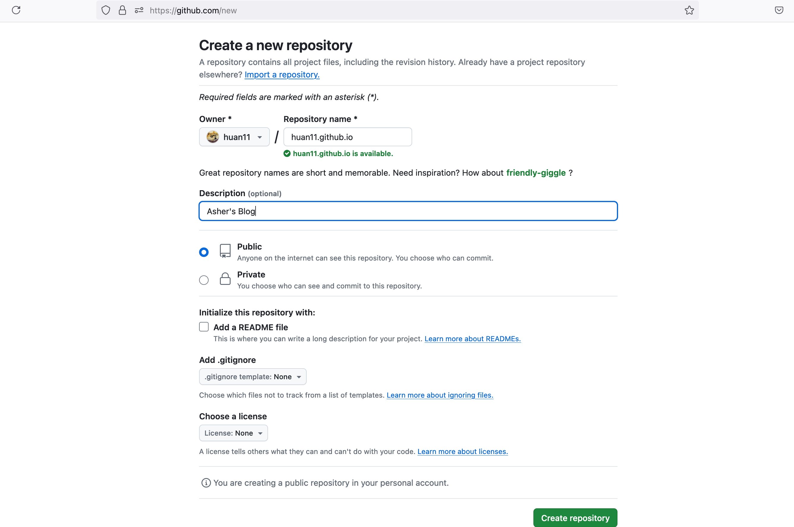
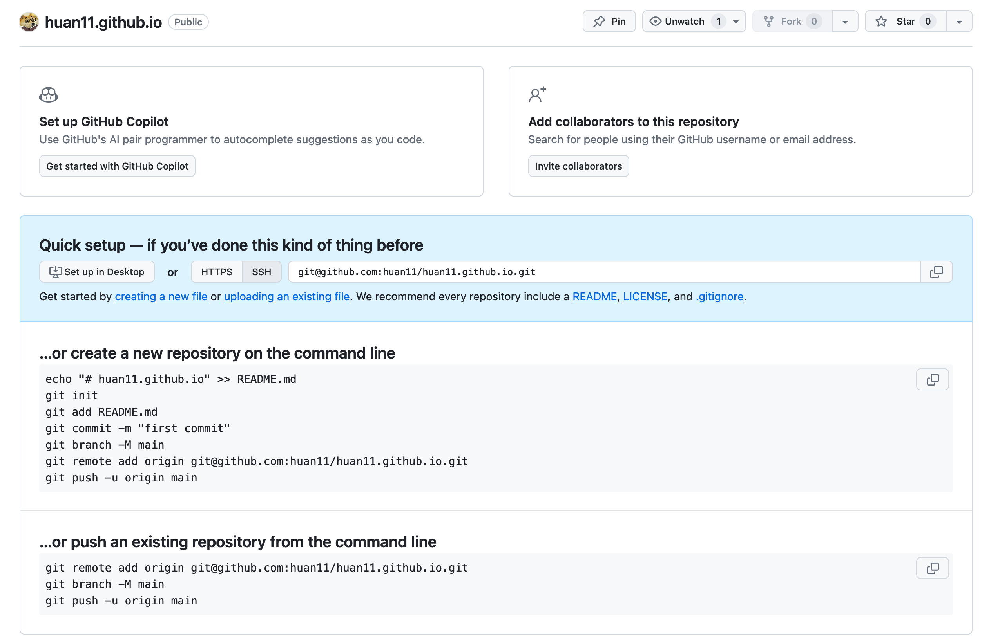
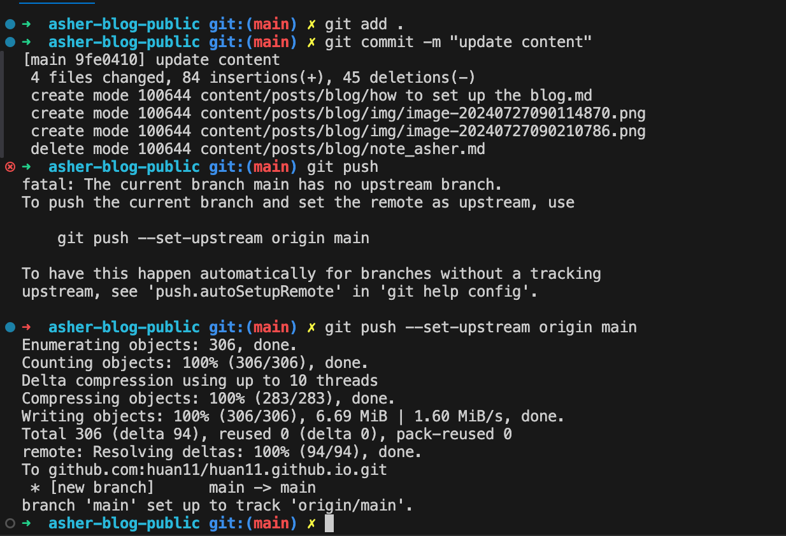
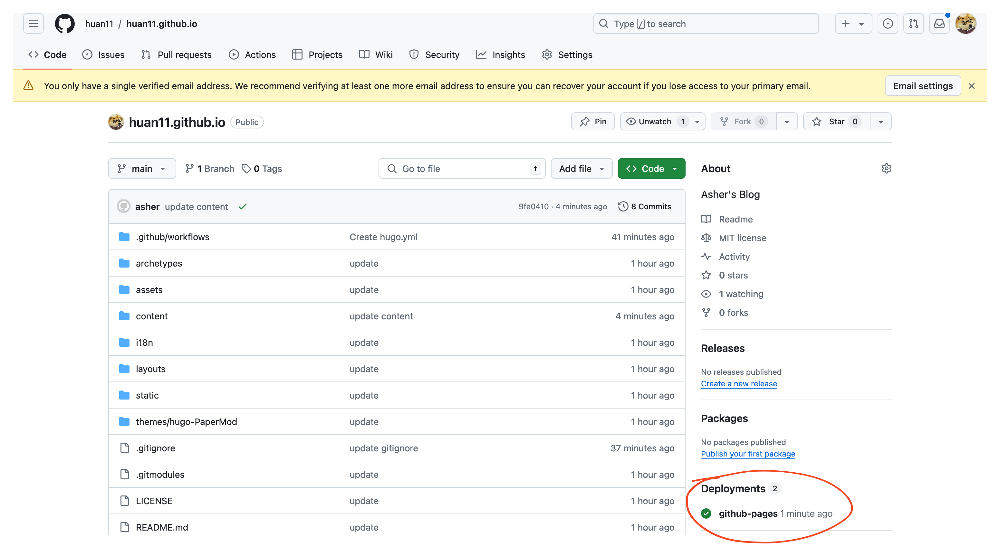
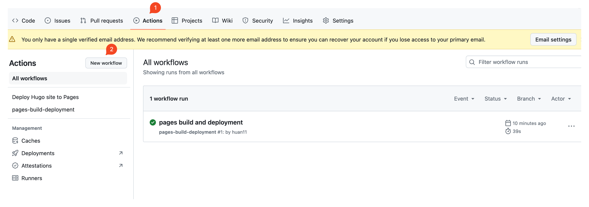
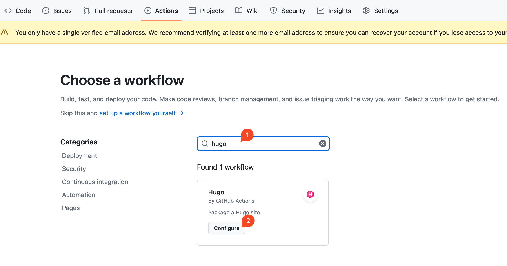
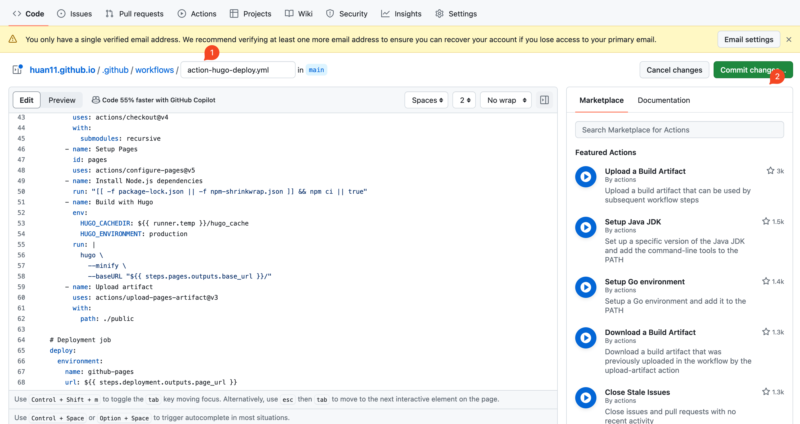
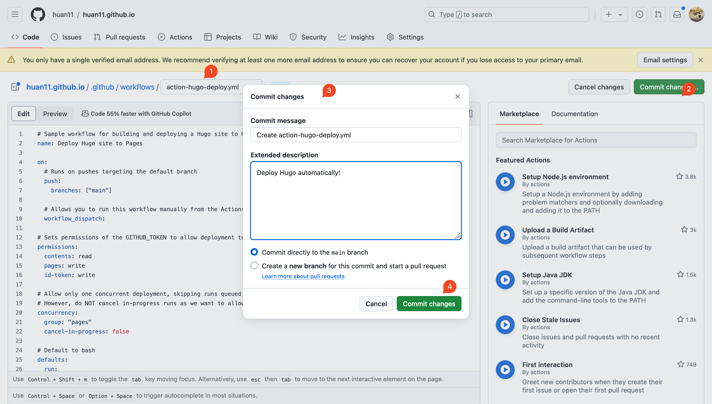
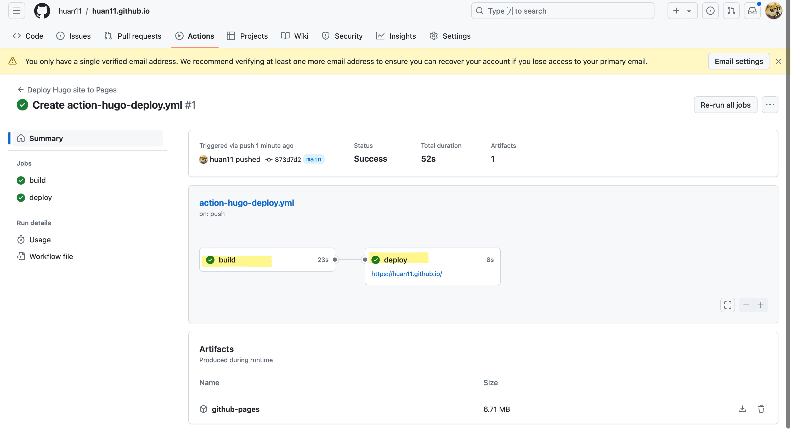

# Dependencies

Setup static blog

1. Git https://git-scm.com/downloads
2. Hugo https://github.com/gohugoio/hugo
3. [optional] markdown editor: Typora

Automatic Deploy

1. GitHub Action https://docs.github.com/en/actions/quickstart

# How to set up Static Blog?

## Setup static blog(3 steps)

Reuse the others framework

> https://github.com/xyming108/sulv-hugo-papermod
>
> preview : https://www.sulvblog.cn/

step 1 clone

```
git clone https://github.com/xyming108/sulv-hugo-papermod.git
```

step2 download theme

```
git submodule update --init
```

Step3 start the

```
hugo server -D
```

## Deploy automatically( steps)

Step create GitHub repo(must public)





Step set up GitHub upstream

```
git remote add origin git@github.com:huan11/huan11.github.io.git
```

Step Add your notes and push the changes

```
git add .
git commit -m "add my notes"
git push
```

Eg:



Check the changes have been pushed to GitHub



Step config GitHub action










